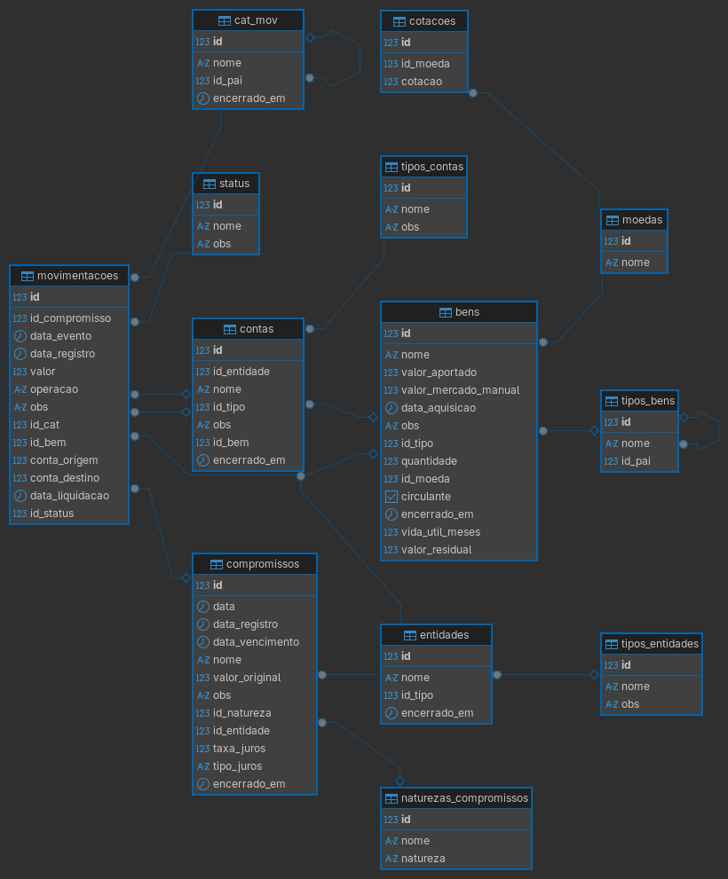

# Aerarium

I built Aerarium because the tools I tried made an assumption: that I should reorganize the way I think about money to fit *their* model. I wanted the opposite. Something that starts from my own categories, my own distinctions, and quietly does the bookkeeping without asking me to be an accountant.

This matters most where the edges get blurry. A credit card bill that hasn't arrived yet, a loan I gave to a friend, an installment I'll be paying for eighteen more months — none of these are "expenses" or "income" in the clean sense. They're promises, weights, events stretched across time. I needed a system that could hold them all in one place and tell the difference between money I have, money I owe, money already spoken for, and money that isn't mine anymore. That sounds obvious. Most personal finance tools can't do it.

The same goes for things: a laptop that slowly becomes worth less, a piece of equipment still in use but nearing replacement. Depreciation isn't abstract when you're the one who'll pay for the next one.

I started this as a way to learn SQL properly — by building something I'd actually use. The schema is in Portuguese because it's my system first, and I haven't yet decided whether that's worth changing. Python will arrive when it's time for automation and a proper interface. For now, it's a relational model, a handful of scripts, and the conviction that managing money shouldn't feel like managing somebody else's money.

## Capabilities

Aerarium covers the territory I actually live in, not the idealized financial life a template assumes.

- **Cash flow.** Aerarium tracks it through categories that make sense to me, not the ones a budgeting app chose before I arrived.
- **Debt and credit in both directions.** A credit card bill that hasn't landed yet, a loan I took or gave, an installment plan with a year left; different in almost every way, alike in one: they're promises.
- **Accounts.** Bank accounts, but also the cash in my drawer, a CDB I can redeem tomorrow, and money set aside for something that hasn't been spent yet. If it holds value and I need to know how much, it belongs here.
- **Assets and depreciation.** Things lose value and Aerarium tracks it linearly; enough to know when replacement is coming, without pretending to be an actuarial table.
- **Provisions.** Money that *will* leave — for a credit card bill, for a depreciating asset, for something promised — is already spoken for. Provisions make that visible.

## Tech stack

### Database

PostgreSQL today. It was the right sandbox for learning SQL from the inside out. Migration to SQLite or Limbo is planned; a local-first system shouldn't carry the weight of a server-grade engine.

### Everything else

Python, when the schema is ready to leave DBeaver. Automation, a proper interface, no sooner than needed, no roadmap with dates.

## Schema



## Installing

### Prerequisites

PostgreSQL 15 or later, running and accepting local connections. No extensions, no superuser — just a `createdb` and a script.

### Setup

Clone the repository, then:

```bash
# 1. With PostgreSQL running, create the database
createdb financas_pessoais

# 2. Run the script
psql -d financas_pessoais -f install.sql
```

`install.sql` will orchestrate every step in order:

1. Tables, not null and check constraints
2. Remaining constraints — primary keys and unique constraints
3. Reference data, such as categories
4. Foreign keys
5. Indexes
6. Views

It stops on the first error. So nothing gets half built.

> The schema lives as individual fragments (`schema/01_tables.sql`, `schema/02_constraints.sql`, ...). Every piece can be inspected, modified or applied individually.

## Backup and data export

Two scripts cover two things worth saving separately.

### Personal data 

Entities, accounts, transactions. Everything you enter over time.

```bash
scripts/exportar_dados.sh
```

> If your PostgreSQL user differs from your OS user, override it: `DB_USER=your_user scripts/exportar_dados.sh`

The output lands in `dados/backups/dados_<timestamp>.sql`. Git ignores that directory. To restore, build the schema from `install.sql` first, then: `psql -d financas_pessoais -f dados/backups/dados_<timestamp>.sql`.

### Schema

After modifying the database, like renaming a category, these fragments need to stay in sync.

```bash
scripts/dump.sh          # everything
scripts/dump.sh tables   # just a single target
```
